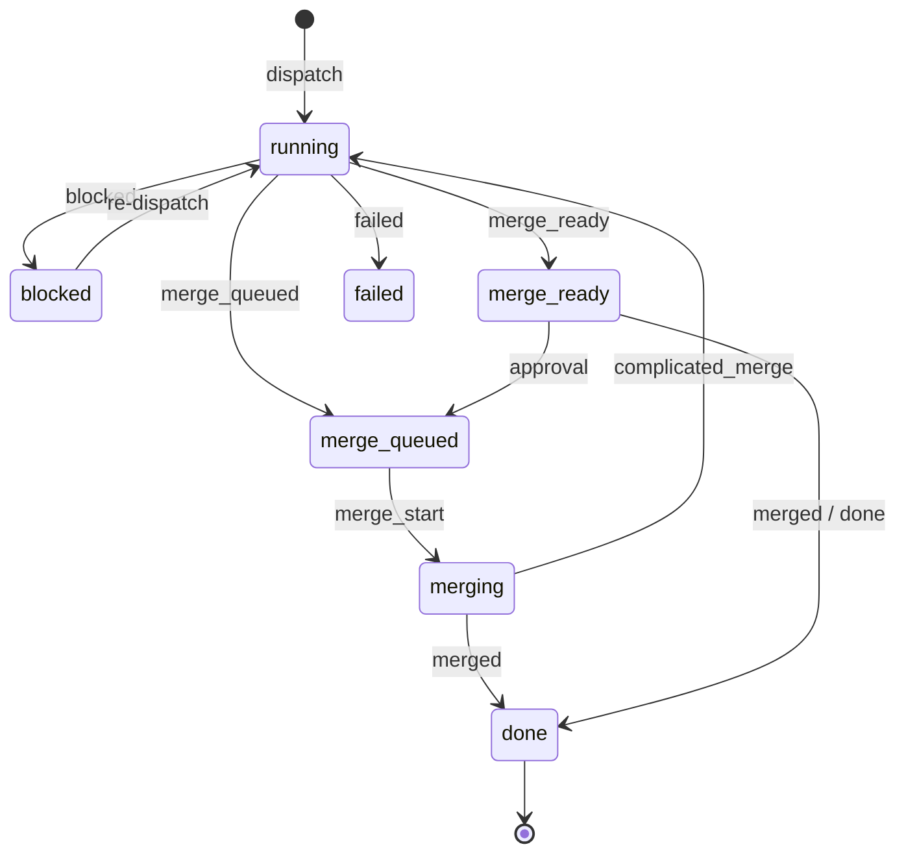
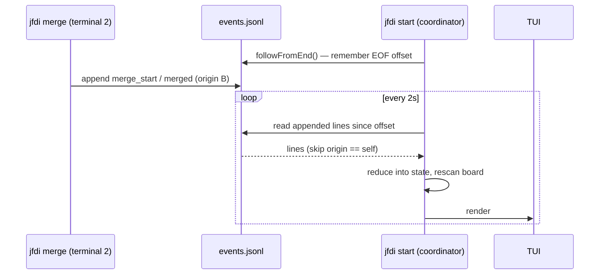

# Events & State

Every significant transition in JFDI — dispatch, stage change, gate result,
escalation, merge — is an event appended to a per-project `events.jsonl`.
Everything else is derived: `state.json` is a snapshot produced by a pure
reducer over the stream, the TUI and inline printer are renderers over it, and
`jfdi status` just prints it. No database, no daemon protocol — rebuildable,
greppable flat files.

Source: [src/events.ts](../../src/events.ts),
[src/state-dir.ts](../../src/state-dir.ts).

## The state directory

Run state lives *outside* the project, keyed by the project root's absolute path
with separators flattened to dashes (`/Users/alice/dev/app` →
`-Users-alice-dev-app`) — the same convention Claude Code uses for
`~/.claude/projects/`:

```
~/.jfdi/projects/<project-key>/
  events.jsonl                 append-only event stream
  state.json                   derived snapshot (safe to delete; rebuilt from events)
  runs/<ticket-id>/
    report.json                the last passing run's report (summary, commit, decisions…)
    history.json               unanswered feedback carried across dispatches
    run-1/, run-2/, …          one directory per dispatch
      round-1/, round-2/, …    one per feedback round
        <stage>.log.jsonl        raw harness session output
        <stage>.verdict.json     the agent's verdict
    integration/
      integration.log.jsonl / integration.verdict.json
      requalify/               the complicated-merge re-QA session
```

`JFDI_HOME` overrides the `~/.jfdi` base — set it (to an absolute path) in tests
and QA sandboxes so nested runs never touch real state. Keeping run state out of
the repo keeps work-tracking churn out of product history and survives worktree
removal; the only in-repo runtime state is `.jfdi/worktrees/`, which is
gitignored.

## The event stream

One JSON object per line:

```json
{"ts":"2026-08-02T17:31:04.512Z","type":"stage_end","ticketId":"fix-total-rounding","origin":"6f1c…","data":{"stage":"qa","verdict":"pass"}}
```

- `ts` — ISO-8601 timestamp.
- `type` — one of the event types below.
- `ticketId` — omitted for the rare non-ticket events (some `error`s).
- `origin` — a random id per event-log instance. Its only job is letting a
  process that tails the shared file skip the lines it wrote itself.
- `data` — type-specific payload; omitted when empty.

### Event types

| Type | Payload | Meaning |
|---|---|---|
| `dispatch` | `title`, `branch` | A run started for the ticket |
| `resumed` | `commitCount`, `hasCheckpointedChanges`, `hasAbortedRebase` | The run continues prior partial work |
| `round_start` | `round` | A feedback round began |
| `stage_start` | `stage`, `isContinuation?` | An agent session started |
| `stage_end` | `stage`, `verdict` | …and ended (`pass`/`fail`/`done`/`escalate`/`clean`/`complicated`, or `invalid-verdict` / `session-failed`) |
| `gate_start` / `gate_result` | — / `ok`, `step?` | Mechanical gate run; `step` names the failing command |
| `session_activity` | `text` | Live narration (tool use, gate step names) |
| `escalation` | `stage`, `question`, `recommendation` | An agent escalated |
| `blocked` | `reason` | The run (or integration) blocked |
| `merge_ready` | — | Passed pipeline awaiting approval (`on-approval`) |
| `merge_queued` | — | Entered the serialized integration queue |
| `merge_start` | `note?` | Integration began |
| `complicated_merge` | `notes` | Conflict resolution touched real logic → re-QA |
| `merged` | `note?` | Landed on the target branch (`note` distinguishes already-contained and hand-merge detection) |
| `done` | `note` | Card closed without a merge event (e.g. dragged out of Ready to Merge) |
| `failed` | `reason` | A dispatch failed unexpectedly |
| `observation` | `text` | An out-of-scope observation became an Inbox card |
| `card_moved` | `from`, `to` | A board card was moved by JFDI |
| `error` | `message` | A non-fatal problem (board write failure, bad stream line) |

## Derived state

`state.json` is produced by folding every event through a pure reducer:

```ts
interface CoordinatorState {
  updatedAt: string;
  tickets: Record<string, TicketState>;
  integrationQueue: string[];
}
interface TicketState {
  id: string; title: string;
  status: "running" | "blocked" | "merge-queued" | "merging"
        | "merge-ready" | "done" | "failed";
  stage: "implementation" | "code-review" | "qa" | "integration" | null;
  round: number; branch: string;
  lastActivity: string; lastEventTs: string;
}
```



The snapshot is rewritten atomically after every append. It is pure convenience:
delete it and it is rebuilt from `events.jsonl` (a corrupt snapshot says so and
tells you to delete it; a full rebuild is strict about malformed lines, while
live tailing is tolerant).

## Multiple processes, one stream

One project's stream is shared by every JFDI process working on it: `jfdi merge`
in a second terminal appends to the same `events.jsonl` a running `jfdi start`
is writing.



Mechanics that make this safe:

- **Origin filtering** — each line carries its writer's instance id, so a
  process never folds its own events in twice.
- **Chunked, resumable tailing** — reads advance only past complete lines
  (a partial line mid-write waits for the next poll), are capped per pull, and
  resync if the file shrank.
- **Tolerant parsing** — a malformed line in the shared file is reported as an
  `error` event and skipped, not fatal to the tailer.
- Foreign events also trigger a board rescan, so work done elsewhere (a merge,
  a close) reaches the coordinator's board bookkeeping without a restart.

This is also the renderer-separation invariant in action: the TUI subscribes to
the event log and renders snapshots — it holds no state of its own, and a future
web UI is just another consumer of the same stream.
