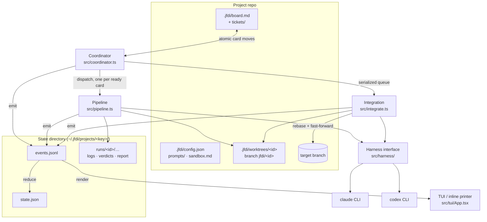
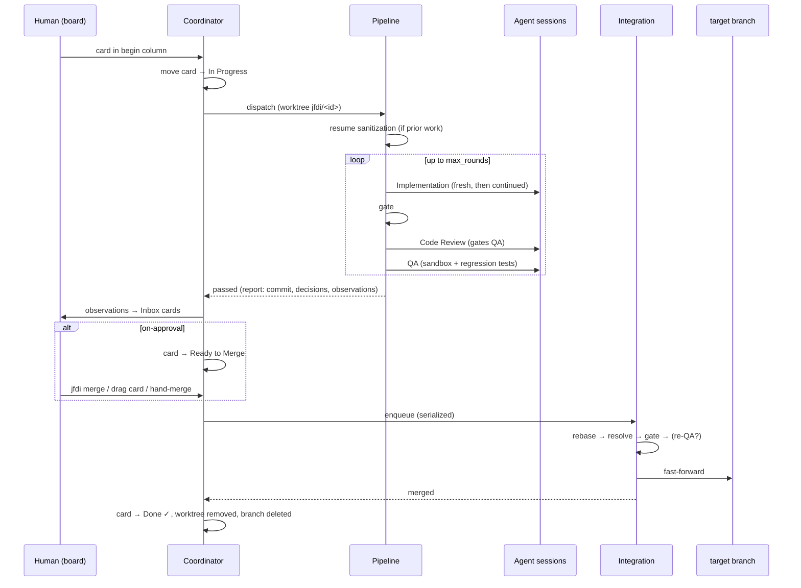

# Architecture Overview

This page is the developer's map of the system: the moving parts, how a ticket
flows through them, and the invariants that hold it together. Companion pages go
deep on the [harness abstraction](harness.md) and the
[event stream & state model](events-and-state.md); the user-facing behavior of
each part is in the [guide](../README.md).

## What JFDI is, structurally

JFDI automates the supervision loop of AI-assisted development: the human writes
tickets; JFDI dispatches agent sessions to implement them, reviews the work from
two independent angles (code quality and functional behavior), and integrates
finished work into the target branch — escalating to the human only at
configured gates or on genuine hard blocks.

It is deliberately a **thin orchestrator**: agents run as headless subprocesses
of an existing coding-agent CLI (Claude Code or Codex), state is flat files, the
merge target is local git, and the UI is a pure renderer. Each of those choices
is an extension seam, not a ceiling — see [Extension seams](#extension-seams).

## Components



- **CLI** ([src/cli.ts](../../src/cli.ts), [src/commands/](../../src/commands/)) —
  a hand-rolled dispatcher; each command lazy-imports its module. `run`, `merge`,
  `status`, and `logs` are one-shot; `start` is the long-running coordinator;
  `init` and `convo` launch interactive harness sessions.
- **Coordinator** ([src/coordinator.ts](../../src/coordinator.ts)) — the
  long-running loop behind `jfdi start`. Watches the board (fs-watch plus a 2 s
  mtime poll), dispatches ready cards into pipelines up to `max_concurrent`,
  owns the single-file integration queue, continues cards an earlier coordinator
  left in the in-progress column, detects hand-merged work, and folds in events
  written by other JFDI processes. It dispatches nothing while the harness is
  paused.
- **Pipeline** ([src/pipeline.ts](../../src/pipeline.ts)) — one ticket's trip:
  worktree setup, resume sanitization, then up to `max_rounds` rounds of
  Implementation → gate → Code Review → QA, with session continuation between
  rounds. Emits events for every transition; writes verdicts and logs to the
  run directory. Detailed walkthrough: [The Pipeline](../guide/pipeline.md).
- **Integration** ([src/integrate.ts](../../src/integrate.ts)) — rebase onto the
  target, agent-driven conflict resolution, gate rerun, the complicated-merge →
  re-QA valve, then a fast-forward. Called by the coordinator (through the
  queue), by `jfdi run` (auto mode), and by `jfdi merge` — same code path, three
  callers. History is strictly linear: rebase + fast-forward, no merge commits.
- **Harness** ([src/harness/](../../src/harness/)) — the provider abstraction;
  see [Harness](harness.md). Constructed **per stage**, not per instance:
  `config.stages` picks a harness (and optionally a model and effort) for each
  of implementation, code review, QA and integration, so a run routinely spans
  two providers. It also classifies its own provider's failures, so a usage
  limit or an outage is never mistaken for bad work.
- **Pause controller** ([src/pause.ts](../../src/pause.ts)) — the tool-wide hold
  that classification feeds. It lives on the `PipelineContext`, so `jfdi run`
  and every dispatched pipeline share one pause and one resume; the coordinator
  consults it before dispatching. Behavior:
  [When the provider goes down](../guide/pipeline.md#when-the-provider-goes-down).
- **Board layer** ([src/board.ts](../../src/board.ts),
  [src/cards.ts](../../src/cards.ts)) — parse, surgical card moves, atomic
  writes. `moveCardSafe` is the single choke point every card move goes through;
  it tolerates human co-edits (card moved: found and retried; card deleted:
  respected) rather than fighting them.
- **Events & state** ([src/events.ts](../../src/events.ts)) — the append-only
  `events.jsonl` stream, the pure reducer that derives `state.json`, and the
  cross-process tail-following; see [Events & State](events-and-state.md).
- **Renderers** — the Ink TUI ([src/tui/App.tsx](../../src/tui/App.tsx)) and the
  inline ANSI printer ([src/commands/context.ts](../../src/commands/context.ts)).
  Both are pure functions of the event stream/snapshot.

## Anatomy of a run



## Hard invariants

These are architectural requirements, not preferences. They are stated here
once; [AGENTS.md](../../AGENTS.md) carries the same list for agents working on
this repo.

1. **Renderer separation.** All UI renders `events.jsonl`/`state.json` only.
   Pipeline and coordinator logic never talk to a UI directly, and no state
   exists only in the UI. This is what makes a future web UI purely additive.
2. **Harness abstraction.** Pipeline logic never touches provider-specific
   details; everything goes through the harness interface. Provider-specific
   accelerations (the Claude format hook) live inside the matching harness
   implementation and degrade gracefully elsewhere.
3. **Serialized integration.** Exactly one integration at a time, pulled from
   the merge-ready queue in completion order. Nothing but Integration ever
   touches the target branch.
4. **Atomic board writes.** The board is co-edited by Obsidian. Every write is a
   read → modify → verify-unchanged → temp-file-rename cycle, retried on
   conflict; edits are surgical (move one card line), never wholesale rewrites.
   Writes follow symlinks so a vault-linked board is updated in place, never
   replaced with a private copy.
5. **Sequential reviews, commit-bound sign-offs.** Code Review gates QA. Both
   sign-offs bind to a specific commit — any code change re-enters at the gate
   and repeats both reviews.
6. **Wikilink scope.** Card wikilinks resolve only against `.jfdi/tickets/`.
   Beyond its own state directory, the tool never reads or writes outside the
   project folder — except through symlinks the user placed inside `.jfdi/`,
   which are treated as consent.
7. **Decide, log, proceed.** Escalation is a last resort and must carry a
   recommended answer. Decisions land in the ticket note; the board is the
   question queue.
8. **The target branch is configurable** — never assume `main`.

## Trust boundaries

Data crossing these boundaries is validated, not trusted:

- **`board.md` and ticket notes** — co-edited by humans and Obsidian; parsed
  defensively, and every write assumes the file may have changed underneath.
- **Harness stream events** — provider JSON lines; a malformed line is simply
  not an event.
- **Verdict files** — written by agents; missing/malformed verdicts are a
  handled outcome (a retried round), not a crash. Field values are coerced and
  re-checked.
- **`events.jsonl`** — shared by multiple processes; the tail-follower skips
  unparseable lines (with an `error` event), and each line's `origin` id keeps a
  process from folding its own events back in twice.
- **Subprocess output** (git, gate commands) — size-capped and error-classified.

## Directory map

```
src/
  cli.ts, index.ts        entry + dispatcher
  commands/               one module per subcommand (+ shared context builder)
  pipeline.ts             the per-ticket stage loop
  coordinator.ts          board watcher + dispatcher + queues
  integrate.ts            rebase/gate/merge + IntegrationQueue
  board.ts, cards.ts      board parsing and surgical writes
  tickets.ts              ticket resolution, note sections
  prompts.ts              default prompt templates + loader (disk wins)
  verdicts.ts             verdict file parsing
  gate.ts                 gate runner
  resume.ts               interrupted-run recovery + feedback history
  report.ts               run reports + observation cards
  events.ts               event log, reducer, cross-process follow
  state-dir.ts            ~/.jfdi/projects/<key> resolution (JFDI_HOME)
  git.ts                  git plumbing (worktrees, rebase, fast-forward)
  harness/                the provider abstraction (see harness.md)
  tui/App.tsx             the Ink TUI
  guidelines.ts           GENERATED from docs/coding-guidelines.md
  fixture-project.ts      test-fixture factory (see ../development.md)
  util/                   ids, fsx (atomic writes), exit codes, dates
```

## Extension seams

Future work slots behind interfaces that exist today; nothing should preclude
them:

- **Ticket sources** — markdown board now; a JIRA-style service later (a daemon
  watching a filter is just another writer of the same dispatch inputs).
- **Merge targets** — local git now; GitHub/Bitbucket PR flows later, behind the
  integration step.
- **Harnesses** — Claude Code and Codex now; any CLI that can run headless with
  JSON output later ([how to add one](harness.md#adding-a-provider)).
- **Renderers** — TUI now; a web UI later, over the same event stream.

Explicitly out of scope for this iteration (don't build toward these): a
PO/orchestrator agent, PRD building or auto-decomposition, pre-implementation
ticket review, a standalone question queue, multi-project support, a ticket
dependency graph.
