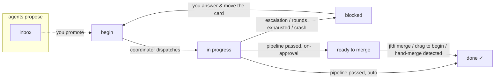

# Board & Tickets

JFDI's work queue is a plain markdown file in the **Obsidian Kanban plugin
format**: `.jfdi/board.md`. It renders as a live drag-and-drop board in Obsidian,
diffs cleanly, and needs no service to host. The coordinator and you co-edit the
same file — that co-editing is a first-class design constraint, not an accident.

## The board file

```markdown
---

kanban-plugin: board

---

## Ready

- [ ] Add a category filter to penny list [[filter-by-category]]
- [ ] Fix the rounding bug in totals [[fix-total-rounding]]

## In Progress

## Done

## Blocked

## Ready to Merge

## Inbox
```

What the parser actually reads:

- A **column** is any `## Heading` line (exactly two hashes). Column names are
  matched by exact string equality against your config.
- A **card** is a top-level `- [ ]` or `- [x]` line inside a column. One card is
  one line. Indented sub-bullets, plain bullets, and `- [X]` (capital) are not
  cards; Obsidian's settings block and any other lines are ignored but preserved.
- Cards above the first heading belong to no column and are ignored.

Keep cards to a single line. Obsidian Kanban allows multi-line card bodies, but
JFDI moves exactly one line — put anything longer in a ticket note.

## Columns and roles

Column *names* are yours; `config.json` maps them to the six roles JFDI cares
about (see [Configuration](configuration.md#board)):

| Role | Default name | Meaning |
|---|---|---|
| `begin` | Ready | Cards here are ready for dispatch — the explicit human "go" signal. Order matters: top card first. |
| `inProgress` | In Progress | Where the coordinator moves a card it has picked up. |
| `done` | Done | Finished, merged cards land here, checked off. |
| `blocked` | Blocked | The pipeline hit a hard block, escalated, or exhausted its rounds. The reason is in the ticket note. |
| `readyToMerge` | Ready to Merge | Used in `on-approval` integration mode: passed pipelines wait here for your sign-off. |
| `inbox` | Inbox | Agent proposals (see [Observations](#the-inbox-observations)). Never dispatched from. |

Cards you place in any other column are never dispatched. `jfdi init` creates the
board with all six columns; a running coordinator ensures Blocked, Ready to Merge,
and Inbox exist. The begin column is never auto-created — if you rename columns in
config, rename them on the board too.

### Blocked-by gating

A ticket note's [`blocked-by` frontmatter](#ticket-notes) gates dispatch. A
begin-column card whose ticket lists a `blocked-by` ticket that is **not yet in
the done column** is not dispatched, however long it sits there. A blocker is
resolved only when its own card reaches Done (cards land there on merge), so the
board stays the single visible truth of what is finished.

- **The coordinator skips; it does not move.** A blocked card is left exactly
  where you put it — Blocked stays the escalation column, and this is not an
  escalation. Each scan re-checks, and the card dispatches on the first scan
  after the last blocker reaches Done. The skip is announced once (a `blocked_by`
  event naming the blockers, and a `waiting on <ids>` status line), and the
  unblock once (`unblocked`) — never once per scan.
- **A dangling blocker still blocks.** A `blocked-by` link whose target has no
  card anywhere on the board counts as unresolved, and the missing id is named in
  the skip event — a broken link is loud, not a silent pass.
- **Cycles are reported, not solved.** If begin-column cards block one another in
  a loop (A `blocked-by` B, B `blocked-by` A), none can ever reach Done, so none
  dispatch. The coordinator emits one `error` event naming the members so you can
  untie it; it never picks a winner.
- **`blocks` does not gate.** Only `blocked-by`, read from the blocked ticket's
  own note, gates its dispatch. `blocks` is the human-facing inverse — mirror it
  as a `blocked-by` on the other ticket to enforce it.

`jfdi run <ticket>` applies the same rule directly: it exits non-zero naming the
unresolved blockers, and `jfdi run --force <ticket>` prints them and runs anyway
(see [the CLI reference](cli.md#jfdi-run-ticket)). Blocking means blocked on
every path; an override has to be spelled out.

## Cards, wikilinks, and ticket ids

A card is a *pointer* to work. Two shapes:

- **Wikilinked**: `- [ ] Fix the thing [[fix-thing]]` — the `[[wikilink]]`
  resolves against `.jfdi/tickets/fix-thing.md` (and **only** that directory;
  JFDI never searches your vault or the wider filesystem). A
  [defined slice](#what-the-agents-actually-read) of the note is the spec handed
  to the Implementation agent. The ticket id is the slugified link target:
  `fix-thing`. The `[[target|alias]]` form works; the alias is ignored.
- **Bare**: `- [ ] Add a --version flag` — the card line itself is the entire
  spec. The id is the first six words slugified plus a 6-character hash of the
  full text (so distinct cards never collide): `add-a-version-flag-3f9a1c`.
  Note that *editing* a bare card's text changes its id — and with it the branch
  and run history it maps to. Use a wikilink for anything you might reword.

The ticket id is the spine of everything: branch `jfdi/<id>`, worktree
`.jfdi/worktrees/<id>/`, run state `runs/<id>/` in the state directory, and the
ticket note `<ticketsDir>/<id>.md`.

## Ticket notes

Ticket notes are plain markdown in `.jfdi/tickets/`, shaped like a JIRA issue.
If a card has no note, the pipeline creates one at dispatch so run records have
somewhere to land.

```markdown
---
mode: ask
blocked-by:
  - "[[extract-storage]]"
---

# Add a category filter to penny list

Users can't see spending in one area without paging through everything.

## Acceptance criteria

- `penny list --category groceries` prints only matching entries.

## Questions

### 2026-08-03 — implementation

**Q:** which flag name?
**Recommendation:** `--category`

## Comments

### 2026-08-03T09:00:00.000Z — implementation round 1

Dispatched onto `jfdi/filter-by-category`.

### 2026-08-03T09:30:00.000Z — Decision (implementation, round 1)

Matched case-insensitively — the ticket didn't say.
```

The anatomy, part by part. Every part is optional; an absent one is simply empty.

- **Frontmatter** — Obsidian properties. Three keys are JFDI's: `mode: ask`
  lowers the escalation bar for this ticket (the agent prefers escalating with a
  recommendation over guessing), and `blocks` / `blocked-by` are lists of
  wikilinks to other tickets. Like card wikilinks they resolve **only** against
  the tickets directory; one that names no note there is reported on the event
  stream (`unresolved_link`) rather than silently ignored. `blocked-by` **gates
  dispatch** (see [Blocked-by gating](#blocked-by-gating)); `blocks` is the
  human-facing inverse and does not itself gate — mirror it as a `blocked-by` on
  the other ticket if you want it enforced. Any other key is yours, and is left
  alone.
- **The H1** — the canonical title.
- **The description** — everything from the H1 down to the first section JFDI
  owns. Write the spec here: acceptance criteria, constraints, context. Your own
  `##` sub-sections are part of it.
- **`## Questions`** — the escalation queue, written on escalation (question +
  recommended answer), on exhausted rounds (the round history), or on a blocked
  integration. Each entry ends with instructions for how to resume.
- **`## Comments`** — an append-only trail, oldest first, in two kinds:
  *transition* entries (`### <ISO timestamp> — <stage> round <n>`) narrating what
  the pipeline did, and *decision* entries (`### <ISO timestamp> — Decision
  (<stage>, round <n>)`), one per autonomous choice an agent logged. This is the
  decide-log-proceed audit trail, and the JIRA emulation: an agent's decisions
  land in the same chronological trail a human's comments would. Every transition
  a run makes is here — dispatch, each commit's message verbatim, each review
  verdict, exhausted rounds, the merge — so the note tells the whole story
  without `git log`, and `git log` tells it without the note. See
  [Commits and the scribe](pipeline.md#commits-and-the-scribe).
- **`## Report`** — the final summary at sign-off: what was done, rounds taken,
  the commit, QA tests added.

Sections JFDI does not recognize — your own, or a legacy `## Decisions` block
from before the anatomy — are never rewritten and never appended to.

Text an agent wrote — a decision, a question, a summary — reaches the note
through a verdict, so JFDI wraps it in a markdown blockquote (`> ` on every
line): in Obsidian the quote bar marks it as an utterance, the way a JIRA
comment reads, and no line of it can read as note structure. Without that, one
entry quoting the format could forge a second section or entry, and everything
after the forgery would silently stop reaching later prompts. Quoting nests, so
an agent's own `> ` lines survive the round trip untouched.

### What the agents actually read

The note is the single human-readable record of what happened to a ticket, and
it is also *input* — but stages read a **defined slice** of it, not the file:

> title + description + `## Questions` + the **decision** entries from
> `## Comments`.

Transition entries, the report, and any unrecognized section stay out. Later
stages must see the decisions (that is what logging them is for), but the
pipeline's narration is written for you, and review feedback already reaches the
implementer through the [feedback history](pipeline.md#rounds-and-feedback) —
piping either into the prompt would waste context and invite an agent to answer
a stale round. A bare card with no note is unaffected: the card line is the
whole spec.

Answering a question still works the way it always did — edit the note, move the
card back to the begin column, and the next dispatch reads your answer in the
description or the questions section.

## The Inbox (observations)

Agents are prompted never to fix out-of-scope issues inline. Instead each stage
reports them as `observations` in its verdict — pre-existing bugs, dead code,
tooling gaps — and after a passing run the coordinator materializes each one as a
card in the inbox column with provenance:

```markdown
## Inbox

- [ ] penny list crashes on a corrupt data file *(from filter-by-category)*
```

The contract: the inbox is agent-writable only via the coordinator, drained only
by the human (promote a card to the begin column, or delete it), and **never
dispatched from** — a card there is inert by definition. Agents propose; humans
promote. Cards are deduplicated by exact text, so a re-run of the same ticket
won't double-file the same observation.

## Co-editing: how writes stay safe

Obsidian writes `board.md`; so does the coordinator as it dispatches and settles
runs, and `jfdi merge` when it closes out a card. Every JFDI write is an atomic
read-modify-write:

1. Read the file and locate the one card line to move.
2. Splice exactly that line out of its column and into the destination — every
   other byte of the file (frontmatter, blank lines, settings blocks, your other
   columns) is preserved.
3. Re-read and compare before writing; if the file changed underneath (you were
   dragging a card at that moment), back off and retry.
4. Write via temp-file-plus-rename in the target's real directory, so the swap is
   atomic and **symlinks are followed** — a `board.md` symlinked into your
   Obsidian vault is updated in place, never replaced with a private copy that
   would silently split the board from the file you edit.

Mid-run human edits are tolerated, not fought: if you move a card while its run
is in flight, JFDI finds it wherever it actually is before parking it; if you
delete a card, it stays deleted — the outcome is recorded in events and the
ticket note, and the board is left as you made it.

## Working with a vault

The board and tickets are work-tracking artifacts, not product code — the
scaffolded `.jfdi/.gitignore` keeps them out of version control, the same way
JIRA tickets wouldn't live in your repo. To see the board in Obsidian, symlink
`board.md` and `tickets/` from inside `.jfdi/` into your vault (or the vault into
`.jfdi/`). Following a symlink you placed is treated as consent: writes land on
the link's target, and that is the only way JFDI ever writes outside the project
folder and its own state directory.

## Board lifecycle at a glance



## Stopping and restarting

Stopping JFDI is not something the board records. Ctrl-C `jfdi start`, or kill
it outright, and its cards stay exactly where they were — including in the
in-progress column, where their branches keep the partial work.

Starting it again picks them back up. A card in the in-progress column that
nothing is driving is dispatched through the same
[resume](pipeline.md#resuming-an-interrupted-run) machinery as any other: the
worktree is sanitized, the branch's existing commits and the previous run's
unanswered feedback go into the prompt, and the run carries on. Such cards go
first (they hold partial work) and count against `max_concurrent`. You do not
have to drag anything anywhere.

This is checked on every scan, not just at startup, so "in progress with
nothing behind it" heals itself rather than being a boot-time special case. A
ticket that genuinely cannot be finished still exhausts its rounds and lands in
**Blocked** the ordinary way; only infrastructure failures are exempt, and
those [pause the tool](pipeline.md#when-the-provider-goes-down) instead.
