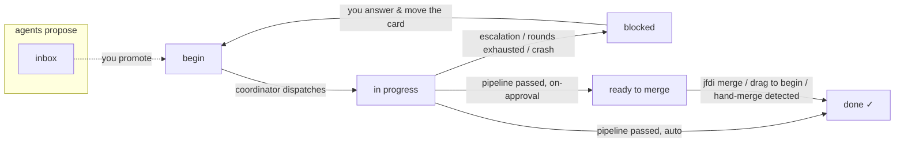

# Board & Tickets

JFDI's work queue is a plain markdown file in the **Obsidian Kanban plugin
format**: `.jfdi/board.md`. It renders as a live drag-and-drop board in Obsidian,
diffs cleanly, and needs no service to host. The coordinator and you co-edit the
same file — that co-editing is a first-class design constraint, not an accident.

## The board file

```markdown
---

kanban-plugin: board

---

## Ready

- [ ] Add a category filter to penny list [[filter-by-category]]
- [ ] Fix the rounding bug in totals [[fix-total-rounding]]

## In Progress

## Done

## Blocked

## Ready to Merge

## Inbox
```

What the parser actually reads:

- A **column** is any `## Heading` line (exactly two hashes). Column names are
  matched by exact string equality against your config.
- A **card** is a top-level `- [ ]` or `- [x]` line inside a column. One card is
  one line. Indented sub-bullets, plain bullets, and `- [X]` (capital) are not
  cards; Obsidian's settings block and any other lines are ignored but preserved.
- Cards above the first heading belong to no column and are ignored.

Keep cards to a single line. Obsidian Kanban allows multi-line card bodies, but
JFDI moves exactly one line — put anything longer in a ticket note.

## Columns and roles

Column *names* are yours; `config.json` maps them to the six roles JFDI cares
about (see [Configuration](configuration.md#board)):

| Role | Default name | Meaning |
|---|---|---|
| `begin` | Ready | Cards here are ready for dispatch — the explicit human "go" signal. Order matters: top card first. |
| `inProgress` | In Progress | Where the coordinator moves a card it has picked up. |
| `done` | Done | Finished, merged cards land here, checked off. |
| `blocked` | Blocked | The pipeline hit a hard block, escalated, or exhausted its rounds. The reason is in the ticket note. |
| `readyToMerge` | Ready to Merge | Used in `on-approval` integration mode: passed pipelines wait here for your sign-off. |
| `inbox` | Inbox | Agent proposals (see [Observations](#the-inbox-observations)). Never dispatched from. |

Cards you place in any other column are never dispatched. `jfdi init` creates the
board with all six columns; a running coordinator ensures Blocked, Ready to Merge,
and Inbox exist. The begin column is never auto-created — if you rename columns in
config, rename them on the board too.

## Cards, wikilinks, and ticket ids

A card is a *pointer* to work. Two shapes:

- **Wikilinked**: `- [ ] Fix the thing [[fix-thing]]` — the `[[wikilink]]`
  resolves against `.jfdi/tickets/fix-thing.md` (and **only** that directory;
  JFDI never searches your vault or the wider filesystem). The note's body is the
  spec handed to the Implementation agent. The ticket id is the slugified link
  target: `fix-thing`. The `[[target|alias]]` form works; the alias is ignored.
- **Bare**: `- [ ] Add a --version flag` — the card line itself is the entire
  spec. The id is the first six words slugified plus a 6-character hash of the
  full text (so distinct cards never collide): `add-a-version-flag-3f9a1c`.
  Note that *editing* a bare card's text changes its id — and with it the branch
  and run history it maps to. Use a wikilink for anything you might reword.

The ticket id is the spine of everything: branch `jfdi/<id>`, worktree
`.jfdi/worktrees/<id>/`, run state `runs/<id>/` in the state directory, and the
ticket note `<ticketsDir>/<id>.md`.

## Ticket notes

Ticket notes are plain markdown in `.jfdi/tickets/`. Write the task spec as the
body — acceptance criteria, constraints, context. If a card has no note, the
pipeline creates one at dispatch so run records have somewhere to land.

During a run the pipeline appends structured sections:

- **`## Decisions`** — autonomous choices agents made mid-run, one line each,
  tagged with round and stage. This is the decide-log-proceed audit trail.
- **`## Questions`** — written on escalation (question + recommended answer), on
  exhausted rounds (the round history), or on a blocked integration. Each entry
  ends with instructions for how to resume.
- **`## Report`** — the final summary at sign-off: what was done, rounds taken,
  the commit, QA tests added, decisions made.

The note is the single human-readable record of what happened to that ticket. It
is also *input*: the whole note body (minus frontmatter) is the spec the next
session sees, which is exactly how answering a question works — edit the note,
move the card back to the begin column, and the next dispatch resumes with your
answer in context.

### Frontmatter

One key is recognized: `mode: ask` lowers the escalation bar for that ticket —
the implementation agent is told to prefer escalating with a recommendation over
guessing on any non-trivial choice.

```markdown
---
mode: ask
---

# Redesign the settings page

…spec…
```

## The Inbox (observations)

Agents are prompted never to fix out-of-scope issues inline. Instead each stage
reports them as `observations` in its verdict — pre-existing bugs, dead code,
tooling gaps — and after a passing run the coordinator materializes each one as a
card in the inbox column with provenance:

```markdown
## Inbox

- [ ] penny list crashes on a corrupt data file *(from filter-by-category)*
```

The contract: the inbox is agent-writable only via the coordinator, drained only
by the human (promote a card to the begin column, or delete it), and **never
dispatched from** — a card there is inert by definition. Agents propose; humans
promote. Cards are deduplicated by exact text, so a re-run of the same ticket
won't double-file the same observation.

## Co-editing: how writes stay safe

Obsidian writes `board.md`; so does the coordinator as it dispatches and settles
runs, and `jfdi merge` when it closes out a card. Every JFDI write is an atomic
read-modify-write:

1. Read the file and locate the one card line to move.
2. Splice exactly that line out of its column and into the destination — every
   other byte of the file (frontmatter, blank lines, settings blocks, your other
   columns) is preserved.
3. Re-read and compare before writing; if the file changed underneath (you were
   dragging a card at that moment), back off and retry.
4. Write via temp-file-plus-rename in the target's real directory, so the swap is
   atomic and **symlinks are followed** — a `board.md` symlinked into your
   Obsidian vault is updated in place, never replaced with a private copy that
   would silently split the board from the file you edit.

Mid-run human edits are tolerated, not fought: if you move a card while its run
is in flight, JFDI finds it wherever it actually is before parking it; if you
delete a card, it stays deleted — the outcome is recorded in events and the
ticket note, and the board is left as you made it.

## Working with a vault

The board and tickets are work-tracking artifacts, not product code — the
scaffolded `.jfdi/.gitignore` keeps them out of version control, the same way
JIRA tickets wouldn't live in your repo. To see the board in Obsidian, symlink
`board.md` and `tickets/` from inside `.jfdi/` into your vault (or the vault into
`.jfdi/`). Following a symlink you placed is treated as consent: writes land on
the link's target, and that is the only way JFDI ever writes outside the project
folder and its own state directory.

## Board lifecycle at a glance



One special case: a card sitting in the in-progress column when `jfdi start`
boots was stranded by a coordinator that died (a **crash orphan**). The startup
sweep moves it to Blocked so you see it; its branch keeps the partial work, and
moving it back to the begin column resumes from where it left off.
