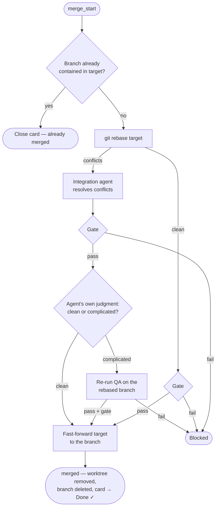

# Integration & Merging

Integration is how finished work lands on the target branch. It is
**coordinator-owned and globally serialized**: any number of tickets build and
review in parallel, but exactly one integration runs at a time, pulled from a
merge-ready queue in completion order. Nothing but Integration ever touches the
target branch.

The target branch is configuration (`integration.target_branch`), never assumed
to be `main`.

## The integration steps

In detail:

1. **Already-merged short-circuit.** If the branch is already contained in the
   target (you merged it by hand), the card is closed without touching git.
2. **Rebase** the ticket branch onto the target, in the ticket's worktree. A
   stale in-progress rebase left by a crash is aborted first.
3. **Conflicts are agent-resolved.** A fresh Integration agent session resolves
   every conflict, preserving both sides' intent, and continues the rebase. It is
   forbidden to abort, force-push, or touch the target branch.
4. **Gate rerun.** The full mechanical gate runs on the rebased result — whether
   or not there were conflicts.
5. **The complicated-merge valve.** The Integration agent judges its own
   resolution: `clean` (adjacent-line noise) or `complicated` (it touched real
   logic). A complicated resolution triggers a fresh QA session on the rebased
   branch — the reviews signed off on a commit that no longer exists as-was, so
   the behavior gets re-validated before landing. QA must pass, and the gate runs
   once more after it.
6. **Fast-forward.** The merge itself is strictly linear: rebase then
   fast-forward (or a plain ref update when the target isn't checked out). No
   merge commits. If the target branch is checked out with uncommitted changes,
   integration blocks rather than stepping on your working tree.
7. **Cleanup.** On success the worktree is removed and the `jfdi/<id>` branch
   deleted; the card moves to Done, checked off, and a dated `## Report` entry is
   appended to the ticket note.

Any failure along the way blocks instead: the card moves to Blocked, the reason
is written into the ticket note's `## Questions`, and **the worktree and branch
are kept for inspection** under `.jfdi/worktrees/`. Fix the problem, then move
the card back to the begin column.

## `auto` vs `on-approval`

`integration.mode` decides what happens when a pipeline passes:

- **`auto`** — the pass flows straight through integration to Done. Good for
  low-stakes repos and high trust.
- **`on-approval`** (the default) — the card lands in **Ready to Merge** with the
  final report appended to the ticket note: summary, rounds taken, the signed-off
  commit, QA tests added, and every decision made autonomously. You review, then
  approve.

### Approving a Ready-to-Merge card

Three routes, all equivalent:

1. **`jfdi merge <ticket-id>`** — runs the same integration path from any
   terminal, even alongside a running coordinator (they share one event stream,
   so the coordinator folds the result in without a restart).
2. **Drag the card back to the begin column.** The coordinator recognizes a
   ticket whose saved report matches the branch's current commit and skips
   straight to integration — no re-run. If the branch has moved past the
   signed-off commit, the full pipeline runs again instead.
3. **Merge the branch by hand.** The coordinator accepts any evidence the work
   landed and closes the card itself: the branch now contained in the target; a
   merge already on record in the event stream; or the signed-off commit
   contained in the target (what a plain `git merge` of a since-deleted branch
   leaves behind). A card you drag *out* of Ready to Merge is acknowledged too —
   to Done or Blocked depending on where you put it — so derived state never
   keeps advertising an approval question the board has already answered.

One caveat on `jfdi merge`: it requires the `jfdi/<id>` branch to still exist. If
you hand-merged and already deleted the branch, let the coordinator's next board
scan close the card (or move it to Done yourself).

## Rejecting

There is no explicit reject command, because none is needed: move the card to
Blocked (recording why in the ticket note), or edit the ticket with what you
actually wanted and move it back to the begin column — the next run resumes on
the same branch with your feedback in context.

## Why serialized?

Concurrent builds finish out of order, and each merge changes the target branch
that the next merge must rebase onto. Serializing integration — one global
critical section, pulled in completion order — is what turns N parallel
pipelines into a linear, always-green target branch. The complicated-merge → re-QA
valve is the safety net for the rebases this forces; a dependency graph between
tickets is deliberately out of scope (ordering is expressed by what you choose to
put in the begin column).
