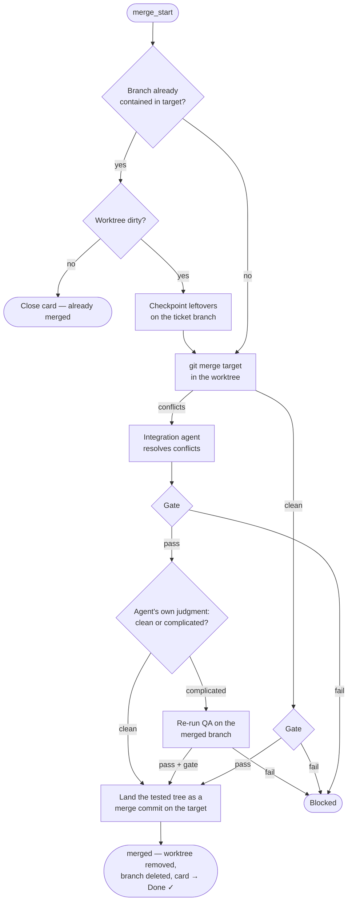

# Integration & Merging

Integration is how finished work lands on the target branch. It is
**coordinator-owned and globally serialized**: any number of tickets build and
review in parallel, but exactly one integration runs at a time, pulled from a
merge-ready queue in completion order. Nothing but Integration ever touches the
target branch.

The target branch is configuration (`integration.target_branch`), never assumed
to be `main`.

## The integration steps

In detail:

1. **Already-merged short-circuit.** If the branch is already contained in the
   target (you merged it by hand) and its worktree is clean, the card is closed
   without another merge. If the worktree is dirty, Integration checkpoints the
   changes on the ticket branch and sends that new commit through the normal
   merge path, where the landing commit keeps it reachable as its second parent.
2. **Merge the target into the ticket branch**, in the ticket's worktree — so
   the merged state is built and tested where the run already lives. A stale
   in-progress merge left by a crash is aborted first (a conflicted merge has
   committed nothing, so this is lossless).
3. **Conflicts are agent-resolved.** A fresh Integration agent session resolves
   every conflict, preserving both sides' intent, and completes the merge. It is
   forbidden to abort, force-push, or touch the target branch. One merge means
   one resolution, however many commits the branch holds.
4. **Gate rerun.** The full mechanical gate runs on the merged result — whether
   or not there were conflicts.
5. **The complicated-merge valve.** The Integration agent judges its own
   resolution: `clean` (adjacent-line noise) or `complicated` (it touched real
   logic). A complicated resolution triggers a fresh QA session on the merged
   branch — the reviews signed off on code that now sits next to changes they
   never saw, so the behavior gets re-validated before landing. QA must pass,
   and the gate runs once more after it.
6. **Land the merge commit.** Anything a session left uncommitted in the
   worktree is committed first — the gate runs against the working tree, so a
   re-QA regression test or a stray resolution file would otherwise be dropped
   from what lands and then lost with the worktree; the ticket note's report
   says when this happened. The tree the gate just passed is then committed with
   the target's prior head as **first** parent and the signed-off branch head as
   **second**, and the target moves to it (a fast-forward, or a plain ref update
   when the target isn't checked out). Always a merge commit, even when a
   fast-forward would do. If the target branch is checked out with uncommitted
   changes, integration blocks rather than stepping on your working tree.
   Conflict resolutions and any re-QA commits made in the worktree land *inside*
   that merge commit rather than as commits of their own — the same shape a
   hand-resolved `git merge` produces.
7. **Cleanup.** On success the worktree is removed and the `jfdi/<id>` branch
   deleted; the card moves to Done, checked off, and a merge entry closes the
   ticket note's `## Comments` trail. That entry carries the run's whole
   [cost-and-time table](pipeline.md#cost-and-time) — every stage, the scribe,
   and an Integration row when a conflict pulled in an integration agent — so the
   closing comment answers "what did this ticket cost" on its own.

Any failure along the way blocks instead: the card moves to Blocked, the reason
is written into the ticket note's `## Questions`, and **the worktree and branch
are kept for inspection** under `.jfdi/worktrees/`. Fix the problem, then move
the card back to the begin column.

## `auto` vs `on-approval`

`integration.mode` decides what happens when a pipeline passes:

- **`auto`** — the pass flows straight through integration to Done. Good for
  low-stakes repos and high trust.
- **`on-approval`** (the default) — the card lands in **Ready to Merge** with the
  final report appended to the ticket note: summary, rounds taken, the signed-off
  commit, QA tests added, and every decision made autonomously. You review, then
  approve.

### Approving a Ready-to-Merge card

Three routes, all equivalent:

1. **`jfdi merge <ticket-id>`** — runs the same integration path from any
   terminal, even alongside a running coordinator (they share one event stream,
   so the coordinator folds the result in without a restart).
2. **Drag the card back to the begin column.** The coordinator recognizes a
   ticket whose saved report matches the branch's current commit and skips
   straight to integration — no re-run. If the branch has moved past the
   signed-off commit, the full pipeline runs again instead.
3. **Merge the branch by hand.** The coordinator accepts any evidence the work
   landed and closes the card itself: the branch now contained in the target; a
   merge already on record in the event stream; or the signed-off commit
   contained in the target (what a plain `git merge` of a since-deleted branch
   leaves behind). A merge another JFDI process is still performing — a
   `merge_start` on the stream with no outcome yet — is left to that process
   to finish and narrate; the coordinator's own `merged` line is reserved for
   merges nothing recorded, so one merge is never told twice. A card you drag *out* of Ready to Merge is acknowledged too —
   to Done or Blocked depending on where you put it — so derived state never
   keeps advertising an approval question the board has already answered.

One caveat on `jfdi merge`: it requires the `jfdi/<id>` branch to still exist. If
you hand-merged and already deleted the branch, let the coordinator's next board
scan close the card (or move it to Done yourself).

## Rejecting

There is no explicit reject command, because none is needed: move the card to
Blocked (recording why in the ticket note), or edit the ticket with what you
actually wanted and move it back to the begin column — the next run resumes on
the same branch with your feedback in context.

## Why serialized?

Concurrent builds finish out of order, and each merge changes the target branch
that the next merge has to reconcile with. Serializing integration — one global
critical section, pulled in completion order — is what turns N parallel
pipelines into an always-green target branch whose first-parent line reads one
ticket at a time. The complicated-merge → re-QA valve is the safety net for the
merges this forces; a dependency graph between tickets is deliberately out of
scope (ordering is expressed by what you choose to put in the begin column).

## Why a merge commit, not a rebase

Sign-offs bind to a specific commit sha. A rebase rewrites the branch, so the
commits the reviewers approved would stop existing the moment integration
succeeded — what landed would be a set of commits no reviewer ever saw, and
every intermediate rebased commit would be a state the gate never ran against.
The merge commit keeps the signed-off sha as a parent: permanently reachable,
and auditable against the ticket note's report.

The tidy view survives it. `git log --first-parent <target>` shows one entry per
ticket, and `git bisect --first-parent` follows the same line; the full graph —
what the agent actually built, which round fixed what — stays underneath instead
of being deleted. Conflicts resolve once for the whole branch rather than once
per commit replayed.

There is no config option for this: merge is the behavior, not a mode.
