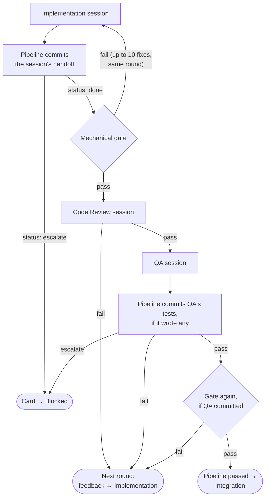

# The Pipeline

This page explains what happens between "a ticket is dispatched" and "the work is
merged (or blocked)": the stages, the mechanical gate, feedback rounds, escalation,
and how an interrupted run resumes. It describes the system as built — the
authoritative behavior lives in [src/pipeline.ts](../../src/pipeline.ts).

For how tickets get *onto* the pipeline (boards, cards, the coordinator), see
[Board & Tickets](board-and-tickets.md) and [Integration & Merging](integration.md)
for what happens after it passes.

## Overview

Every ticket runs in its own **git worktree** on branch `jfdi/<ticket-id>`, created
from the integration target branch. Inside that worktree, up to `pipeline.max_rounds`
**rounds** run (default 3). Each round is:



Three properties are worth internalizing:

- **A gate failure after Implementation stays inside the round.** The pipeline
  runs the gate — the agent is told not to — and hands a failure straight back
  to the same Implementation session as feedback, up to 10 fix sessions per
  round. Rounds mean moving on to other agents, not iterating with the machine;
  only a gate that is still red after those fixes consumes the round.
- **A spec-invalid verdict also stays inside the round.** The pipeline returns
  the concrete parse or field error and the verdict path to that stage's own
  session. The agent gets two correction attempts; a verdict still invalid after
  both blocks the ticket as a malfunction instead of spending a feedback round.
- **Every agent failure re-enters at Implementation.** There is no partial
  re-entry: a Code Review fail or a QA fail starts the next round at the top.
  Both review sign-offs bind to a specific commit, so any code change invalidates
  both and the new commit repeats the gate and both reviews.
- **Code Review gates QA.** A round where Code Review fails never runs the sandbox —
  the cheap review screens the expensive one.
- **The gate is the cheapest reviewer and always runs first.** Reviews spend agent
  tokens only on what machines can't check.
- **The pipeline owns the commits.** No stage commits its own work; the pipeline
  commits once per session, and the sign-offs bind to *that* commit. See
  [Commits and the scribe](#commits-and-the-scribe).

## Stages

Each stage is one agent session — Claude Code or Codex, with whatever model and
effort that stage's [`stages` entry](configuration.md#stages) names — spawned
headless in the ticket's worktree with a stage-specific prompt. Stages need not
agree: the scaffolded default deliberately reviews on a different provider than
it implements on. The prompt templates live in `.jfdi/prompts/` and are yours to
edit — see [Prompts & Customization](prompts-and-customization.md).

| Stage | Job | Can escalate? |
|---|---|---|
| **Implementation** | Does the work, writes unit tests alongside the code. It does not run the gate — the pipeline runs it after the session and returns any failure as feedback. | Yes |
| **Code Review** | Judges the diff on structure, clarity, conventions, and maintainability — *not* functionality. | No — an attempted escalation is a spec-invalid verdict and enters the two-attempt correction path |
| **QA** | Exercises the built artifact per the [sandbox contract](prompts-and-customization.md#the-sandbox-contract), validates behavior against the *ticket* (not the diff), and writes what it verified as automated regression tests. | Yes |

Integration is the fourth agent, but it is owned by the coordinator, not the ticket
pipeline — see [Integration & Merging](integration.md).

### What each stage sees

The pipeline does the mechanical work outside sessions so agents don't burn turns
collecting context:

- **Implementation** gets the ticket spec, the branch and target branch names, the
  gate command list, and — when relevant — a resume section (see
  [Resuming](#resuming-an-interrupted-run)) and the accumulated feedback from
  earlier attempts.
- **Code Review** gets the ticket note path, the passing gate summary (and is told
  to trust it, never re-run it), the commit log and diffstat against the target
  branch, and the full diff inline when it fits (up to 40,000 characters — larger
  diffs are read per-file inside the session).
- **QA** gets the ticket note path, the sandbox contract, the gate summary, the
  commit log and diffstat — deliberately **not** the diff. QA derives its checks
  from the ticket, adversarially, so it can catch what the implementation missed
  rather than confirming what it did.

### Verdicts

Every session must end by writing a single JSON verdict file at a path the prompt
names. That path is inside the worktree (`<worktree>/<stage>.verdict.json`) —
the one location every provider's sandboxed permission mode lets an agent write —
and the pipeline collects the file into the run's state directory
(`<state dir>/runs/<ticket-id>/run-<k>/round-<n>/<stage>.verdict.json`) as soon
as the session ends, before anything commits the tree. The pipeline reads
outcomes *only* from the collected file:

```jsonc
// Implementation
{ "status": "done" | "escalate",
  "summary": "…", "decisions": ["…"], "observations": ["…"],
  "question": "only when escalating", "recommendation": "only when escalating" }

// Code Review
{ "verdict": "pass" | "fail",
  "feedback": "when failing: specific, actionable items",
  "decisions": ["…"], "observations": ["…"] }

// QA
{ "verdict": "pass" | "fail" | "escalate",
  "feedback": "when failing: what's wrong, with reproduction steps",
  "testsAdded": "summary of the tests it wrote",
  "decisions": ["…"], "observations": ["…"],
  "question": "…", "recommendation": "…" }
```

A missing verdict file keeps the existing session-failure behavior: the stage is
treated as "did not produce a valid verdict" and the round retries with that as
feedback. An existing file that does not meet spec is different: JSON parse
failures, a missing required discriminator, and a discriminator outside its
allowed enum are returned immediately to the same stage session with the concrete
error and agent-facing verdict path. The agent gets two correction attempts in
the same round. A forgotten session falls back once to a fresh spawn carrying the
same correction message; it does not enlarge the cap. If the second correction is
still invalid, the run blocks and the ticket comment quotes the final error and
path. A markdown code fence around otherwise valid JSON remains tolerated. Two of
the fields matter beyond pass/fail:

- **`decisions`** — autonomous choices the agent made, each appended to the
  ticket note's `## Comments` trail as a
  [decision entry](board-and-tickets.md#ticket-notes) stamped with stage and
  round. This is the audit trail for the decide-log-proceed posture, and the one
  part of the trail later stages read back.
- **`observations`** — out-of-scope issues the agent noticed (pre-existing bugs,
  dead code, tooling gaps). Never fixed inline; every valid verdict contributes
  them regardless of pass/fail/escalate outcome. They become proposal cards in
  the board's **Inbox** column on every run exit, deduplicated by text and tagged
  `*(from <ticket-id>)*`. A boardless direct run prints them in its summary.
  Agents propose; humans promote.

## Commits and the scribe

**Agents never commit. The pipeline commits once per session.** Message quality
used to vary by provider, and a session that died before its own commit lost its
work silently. Both are gone: the pipeline records HEAD before each session and,
when the session ends, folds whatever it left into exactly one commit.

- **Enforcement is mechanical, not prompt-hope.** A session that commits anyway
  is `git reset --soft` back to the pre-session HEAD, so its commits become
  staged changes and the pipeline's single commit takes their place. Reviewers
  are reset harder still: a Code Review session never moves the branch.
- **Failed and interrupted sessions commit too** — every session end, success or
  not. The message carries a `WIP —` subject marker and the reason. This is what
  makes [resuming](#resuming-an-interrupted-run) reliable: sanitization discards
  uncommitted changes, so partial work has to live in a commit.
- **A session that changed nothing produces no commit.** A normal review, or a
  passing QA that wrote no tests, leaves the branch alone; its outcome reaches
  the ticket note as a comment instead.

The message is written by the **scribe**: a cheap, read-only, single-shot
session, selected by the [`stages["commit-message"]`](configuration.md#stages)
entry. The pipeline hands it the staged diff, the ticket, the stage's own
summary — the "why" the diff can't carry — and the round. It is not a stage: no
verdict, no round of its own, no sign-off.

The shape:

```
<ticket-id>: <imperative summary, ≤72 chars>

<body, written for a reader with zero context who was not in the session>

JFDI <Stage> <outcome> — <where the run actually went>

JFDI-Round: <n>/<max>
JFDI-Duration: <agent time, e.g. 7m>
JFDI-Cost: <e.g. $1.87, or "1.2M tokens, price unavailable">
```

The scribe writes the subject and body only. The status line and the trailers are
appended by the pipeline, so they never depend on an agent getting a format
right: `git log --format='%(trailers:key=JFDI-Cost)'` always answers. The
blank line above the trailer block is load-bearing: git only reads a message's
last paragraph as a trailer block when every line in it is trailer-shaped, so the
three `JFDI-*` trailers share one paragraph and the status line stands apart.

`JFDI-Duration` is agent time — wall-clock the pipeline measures around the
session, not anything the provider reports (Codex reports no duration at all).
`JFDI-Cost` is dollars when the price is known: Claude reports its cost directly
and JFDI uses it verbatim; Codex reports only tokens, so JFDI multiplies them by
a maintained [price table](#cost-and-time) and shows `price unavailable` with a
token count when the model is not in it. A Codex figure is a table estimate that
runs low — cache writes and long-context tiers are unpriced because Codex reports
no counts for them — so it carries a brief `(estimate, runs low)` qualifier;
Claude's verbatim figure stands alone. Tokens are the machine record —
diagnostics on the event stream and `report.json`, and the fallback in prose when
no price is known — never shown beside a dollar figure.

What comes back is subprocess output on its way into permanent history. The
72-character subject length is guidance to the scribe, not an enforcement
threshold: the pipeline uses a non-empty first line as the subject verbatim even
when it is longer. The body has no length bound. Control characters git or a
terminal would choke on are stripped once from the assembled message — covering
the scribe's answer and the stage's summary together at the history boundary,
never per fragment. The status line's outcome and routing are pipeline-produced
and single-line by construction; commit-message assembly asserts that invariant
rather than coercing their content. A scribe that dies or answers with nothing
gets the pipeline's plain fallback subject and degrades to the stage's own
summary — the commit is never delayed for prose — and says so on the event
stream.

### The comment trail

Every transition is also appended to the ticket note's `## Comments` section, so
`git log` and the note each tell the story on their own. For a commit, the entry
is the rendered message **verbatim** — one rendering, two surfaces. The trail
covers:

| Transition | Entry |
|---|---|
| dispatch | "JFDI run started — round 1, branch jfdi/&lt;id&gt;" |
| an implementation or fix session | the commit's message |
| a review verdict | "JFDI Code Review PASSED — moving to QA", or FAILED followed by the exact feedback the implementer received; the same for QA |
| rounds exhausted | "JFDI run exhausted its N rounds — moving to Blocked for human review", with the round history |
| integration | "JFDI Integration merged — landed on main as &lt;sha&gt;", or blocked with the reason |
| a decision | one entry per `decisions` item, in the [decision format](board-and-tickets.md#ticket-notes) |

Two deliberate absences: **no comment for a pause** — infrastructure holds are
not ticket history — and agents never write the note themselves. Every append is
pipeline-owned and atomic (read → mtime check → temp-file rename, following
symlinks to the real file), so a human editing the note in Obsidian mid-run
loses nothing.

### Cost and time

Every session's cost and time ride its handoff commit as the `JFDI-Duration` and
`JFDI-Cost` trailers (above), and a human should be able to see what a ticket
cost from whichever surface they are looking at. Where more than one stage's
numbers appear together, they appear as a table. The **ready-to-merge** comment
(on-approval mode) and the **merged** comment both carry the whole run:

| Stage | Model | Sessions | Time | Cost |
|---|---|---|---|---|
| Implementation | claude-opus-4-8 (provider-confirmed) | 2 | 28m | $9.00 |
| Code Review | gpt-5.6-sol (configured) | 2 | 6m | $2.50 |
| QA | claude-opus-4-8 (provider-confirmed) | 1 | 7m | $1.87 |
| Scribe | claude-sonnet-5 (provider-confirmed) | 3 | 1m | $0.04 |
| **Total** |  | **8** | **agent 42m · elapsed 3h 10m** | **$13.41** |

Every session is counted, the scribe included — a total that omits sessions is a
lie. Each model the provider reports is labeled **provider-confirmed**; when it
reports none, the configured model is shown and labeled **configured** instead.
If continuations use more than one model, the row lists every one. Two clocks are
labeled distinctly: **agent** time is the wall-clock summed
around the sessions themselves; **elapsed** is dispatch → merge-ready, which
includes everything the run waited on in between. A row (or the total) whose
price is unknown shows a token count instead of dollars, never a guessed figure;
when any dollars in the table are Codex table estimates, a one-line note under it
says so (they run low).

The price table lives in code (`src/harness/codex-pricing.ts`), not config:
Claude reports its cost directly, Codex reports only tokens, so JFDI prices those
from a small maintained table covering the models it ships. A stale table is a
versioned fix, never a per-project chore — which is why `unknown` is deliberate,
the signal to update it. `jfdi status` and the TUI show each ticket's running
cost and agent time, read from `state.json` alone. There is no project-level
rollup (no per-week spend, no `jfdi cost`) — the event stream carries everything
needed to build one later.

## The mechanical gate

The gate is the ordered list of shell commands in `config.json`'s `gate` array
(build, test, lint — whatever must exit zero). Commands run sequentially in the
worktree via `/bin/sh -c`, stopping at the first failure; the failing command's
interleaved output (last 20,000 characters) becomes the feedback for the next
Implementation fix session. The pipeline runs the gate; agents are told not to.

The gate runs at five points:

1. After Implementation hands off and the pipeline commits it, before Code Review
   ("done" isn't done until it passes)
2. After the pipeline commits QA's tests, if it wrote any (QA's own tests must pass too)
3. During integration, after a clean merge, pre-land
4. During integration, after agent-driven conflict resolution
5. During integration, after re-QA on a complicated merge

An empty `gate` array always passes — `jfdi init` exists to make sure you never
run with one. Reviewers are shown the gate's passing summary and told not to
re-run it; QA runs only the tests it adds.

## Rounds and feedback

A **round** is one trip through the flowchart above. When a step fails, the
pipeline records a feedback item — `{run, round, source, feedback}` where source is
`gate`, `code-review`, `qa`, or `implementation` — and starts the next round.
When rounds are exhausted, the card moves to **Blocked** and the round history is
written into the ticket note's `## Questions` section with instructions for
retrying.

The post-Implementation gate is one exception: its failure feeds back into the
same Implementation session *within* the round, and the gate reruns — up to 10
fix sessions per round. A round is spent when the work moves to other agents (or
when the gate is still red after those fixes), so a hard-to-green gate cannot
silently eat the whole round budget one compile error at a time.

A spec-invalid verdict is the other exception. It returns to the stage that wrote
it for up to two corrections in the same round. Persistent invalid output blocks
the ticket directly; it never becomes feedback for another round.

Every gate attempt writes its complete combined output to a numbered `gate-*.log`
file in the run directory before JFDI excerpts it for prompt context. Failure
feedback names that file and quotes a 20,000-character head-and-tail excerpt, so
the first causal diagnostic and the final summary remain visible without spending
the prompt budget on the full transcript. Red attempts remain on disk when a later
attempt turns green.

### Fresh sessions vs. continuations

Round 1 of every stage is always a **fresh** session — the independence of fresh
eyes is the point of the review stages. Later rounds of the *same run* **continue**
the stage's own previous session (`claude -p --resume` / `codex exec resume`) with
a short brief instead of paying a fresh session to re-derive context it already
had:

- A continued **Implementation** session gets just the failure: the gate output, or
  the reviewer's items, framed by who produced them.
- A continued **reviewer** gets the delta since its last look — new commits and
  touched files — plus *provenance*: a reviewer who passed last round is told the
  new commits answer QA's feedback (quoted), not its own sign-off, so it doesn't
  re-litigate what it already approved.
- A continued **QA** session is told its own previous feedback is the checklist:
  verify each reported failure is fixed and re-run enough earlier checks to catch
  regressions.

If the provider has forgotten the session, the stage falls back to exactly one
fresh session with the full prompt and accumulated feedback. Session memory is
per-run and in-memory only: a re-dispatch always starts every stage fresh.

## When the provider goes down

A session can also die for a reason that has nothing to do with the work: a
usage limit, an expired login, a 5xx. Treating that as feedback would be a
disaster — the next round spawns into the same wall, `max_rounds` burns in
seconds, and the coordinator moves on to drain the rest of the board the same
way. So it isn't feedback. The harness classifies it
([how](../architecture/harness.md#failure-classification)), and the tool stops.

**The run holds where it stands.** No round is consumed, no feedback is
invented, the card stays in **In Progress**, and the in-memory state — round
counter, feedback history, session memory — is untouched. When the pause lifts,
the same stage runs again: continuing its session if one was captured,
otherwise a fresh spawn with the same prompt.

**The pause is global.** One failure stops everything: no new dispatches, and
every in-flight pipeline holds at its next stage boundary. `jfdi run` uses the
identical code path and behaves identically. *Nothing lands in Blocked for an
infrastructure reason.*

What lifts it depends on the class:

| Class | What it is | What resumes it |
|---|---|---|
| **usage-limit** | quota exhausted | the stated reset time plus a minute's slack, automatically. No human needed. If the provider named no time we could read, the outage schedule below is used instead — a limit self-expires, so it never demands a keypress. |
| **outage** | 5xx, network, capacity | three stage-local retries first (5 s, 20 s, 60 s); still failing, it escalates to a global pause that re-probes on a stepped, capped backoff (1 min, 5 min, then every 15 min). Resumes by itself when the provider recovers. |
| **needs-human** | expired login, revoked key, out of credits | **nothing automatic.** The banner names the repair and waits. |

`R` retries immediately in every case — that is the only way out of a
needs-human pause, and a way to skip the wait in the others. In the TUI it is a
keypress; `jfdi run` takes the same key on its terminal, and prints the pause
reason and resume time as it goes. A session that reaches the provider resets
the backoff to its first step.

The pause is announced on the event stream as `harness_paused` /
`harness_resumed`, carrying `{kind, detail, resumesAt?}`, which is what the TUI
banner renders. It is deliberately **not** persisted: a pause is a fact about
the provider right now, not about the run. Stopping JFDI and starting it again
is not an event — see
[after a stop](board-and-tickets.md#stopping-and-restarting).

## Escalation and Blocked

The default posture is **decide, log, proceed**: at a decision fork the agent makes
the reasonable call, records it as a decision comment, and continues. Escalation is
prompted as a last resort for genuine hard blocks — contradictory requirements,
missing access, work impossible as specified — and must carry a recommended
answer, never a bare question.

When Implementation or QA escalates:

1. The question and recommendation are appended to the ticket note under
   `## Questions`, dated and stage-tagged, with a footer telling you how to resume.
2. The run ends; the card moves to **Blocked**. The worktree and branch are kept.
3. You answer by **editing the ticket note** and moving the card back to the
   begin column. Write the answer in the **description** or under
   `## Questions` — those are the parts of the note the next session reads (see
   [the slice](board-and-tickets.md#what-the-agents-actually-read)); an answer
   typed into `## Comments` or a section of your own never reaches it. The next
   dispatch resumes from the existing branch with the answer in context.

The safety net for wrong autonomous calls is layered: Code Review and QA judge the
work against the ticket, and the decision log surfaces in the final report before
merge — wrong calls get caught pre-merge without mid-flight interruptions.

Per-ticket override: put `mode: ask` in the ticket note's YAML frontmatter to
lower the escalation bar for tickets where you want check-ins. This reaches the
implementation prompt as an explicit "prefer escalating with a recommendation over
guessing" instruction.

## Resuming an interrupted run

Runs can die mid-pipeline — an escalation, exhausted rounds, a killed session, a
coordinator crash — leaving partial commits and possibly a dirty or mid-merge
worktree. Re-dispatching the card (moving it back to the begin column) reuses the
branch and resumes deliberately:

1. The previous run's `history.json` is loaded before the worktree is touched.
   Because JFDI writes this file atomically, malformed JSON or an invalid entry
   blocks the card with an error event and a warning comment naming the content.
   Fix the file to preserve its feedback, or delete it to deliberately resume
   without history; moving the card back before either action blocks it again.
2. Any in-progress merge is aborted. If git cannot abort it (a stale
   `index.lock`, an unwritable file), the run stops there and the card is
   blocked — dispatching onto a half-merged tree would hand the agent conflict
   markers and commit them.
3. Any uncommitted changes are checkpoint-committed as
   `jfdi(<ticket-id>): recovered from interrupted run`, so the session starts from
   a clean, committed tree. In practice there is rarely anything left to
   recover: the pipeline already committed each session's work as that session
   ended, so what the branch holds is a `WIP —` commit with the reason on it.
4. The Implementation prompt carries a resume section: how many commits the branch
   already holds, a short log, what was recovered — with explicit instructions to
   continue the work, not start over.
5. Unanswered feedback from the previous run (persisted as `history.json` in the
   run directory, capped at the 10 most recent items) is carried into the prompt
   as well. Each retry save includes inherited feedback, so interruption between
   rounds cannot strand it in an older run. If the cap discards items, the file
   records the number discarded and the run that produced them.

## Outcomes

A run ends in one of two states:

- **Passed** — every stage signed off on the final commit and the gate is green.
  What happens next depends on `integration.mode`: `auto` merges immediately;
  `on-approval` moves the card to **Ready to Merge** and appends a ready-to-merge
  comment (summary, rounds, commit, QA tests added, and the `jfdi merge` approval
  line) to the ticket note for your review — the autonomous decisions are already
  their own decision comments above it. See [Integration & Merging](integration.md).
- **Blocked** — an escalation, exhausted rounds, malformed feedback history, or a
  failed integration. The card moves to **Blocked**, the reason is in the ticket
  note, and the worktree is kept for inspection. `jfdi run` exits with code 2 in
  this case.

Either way, the complete paper trail is on disk: the ticket note holds the
human-readable record (`## Comments`, `## Questions`), and the state
directory holds the machine record — per-round verdicts and raw session logs under
`runs/<ticket-id>/run-<k>/`, viewable with `jfdi logs <ticket-id>`. See
[Events & State](../architecture/events-and-state.md) for the full layout.
